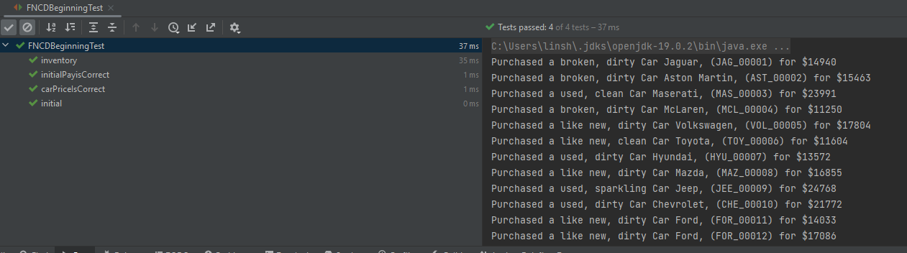
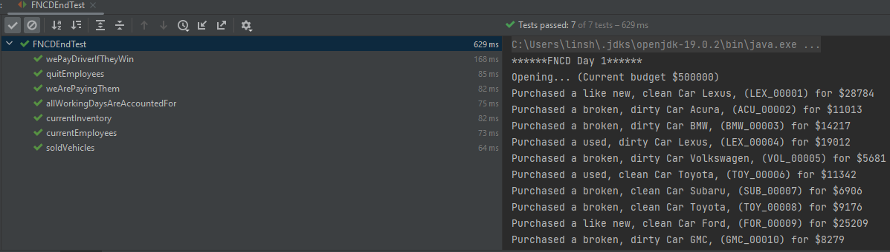

### CSCI 4/5448 OOAD
###### Group: Anuragini Sinha & Lin Shi
This is the repository for CSCI 4/5448 OOAD.  
This is the directory for project 3

#### What has changed between 3.1 UML and 3.2 UML
First, we realized that the decorator needs to extend from the Vehicle class, not the Salesperson class. Additionally, we changed the method call from updateStat() to getPercent(). Second, 
we had to add a addDecorator() function to make Salesperson work. Third, for the races, the appropriate functions were included in FNCD. In StaffDriver(initially named Driver, but we have a Driver class to start the program), 
we had to include two function, setInjuried() and selfExam(), that sets the determines whether a driver is injured and set the appropriate settings. Fourth, the functions in observer is changed after implementing the Flow Api.
We implemented all the methods from the subscriber class, but only onNext() and onComplete() was really used. Furthermore, there are some small modifications such as extracting some helper function in FNCD to create a Helper class. 

#### Extra credit:
I used intellij to run all my Junit tests, so it was kind of cheating in that I just clicked everywhere that gave me an error and told the IDE to install it. 
I believe Junit 4 was used. Additionally, I split my tests into two parts: the beginning of the simulation and the end of it. 

##### Assumption:
* The intern must wash two different vehicles for each iteration. If there is just one vehicle to wash, then the intern will only wash one car. (same applies to mechanics).
* We decided to use integer values based on the sample output.
* The simulation start on day 1 (Monday). Therefore, day 7, 14,... will be considered Sunday.
* All name are generated using **position_<unique id>**. Therefore, when an intern steps up to take a Mechanic or Salesperson's job, their position will change, but <unique id> will stay the same.
* Since we are just adding $250000 everytime that we do not have money, I am allowing the possibility of negative budget given that we will receive extra money at the end of the day. 
* We interpreted Sunday as race day only. We did see the piazza later, but ran out of time to fix it and given that the interpretation was okay, we kept it that way. 
* We include a numeric ending to all the vehicles in the order that it was purchased. Therefore, we thought it was okay to use that for the numeric ending for monster truck. 
* Based on the requirement, it seems that the use of Flow API was not required, so I used the Flow API, but we do not think that it was utilized correctly. 