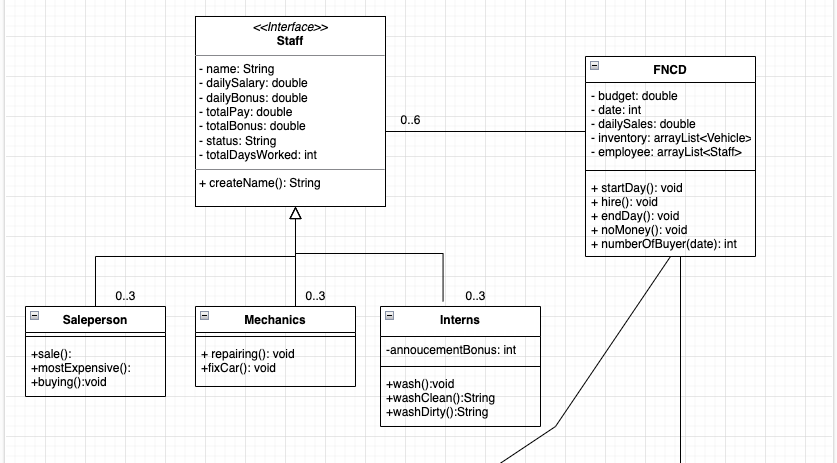
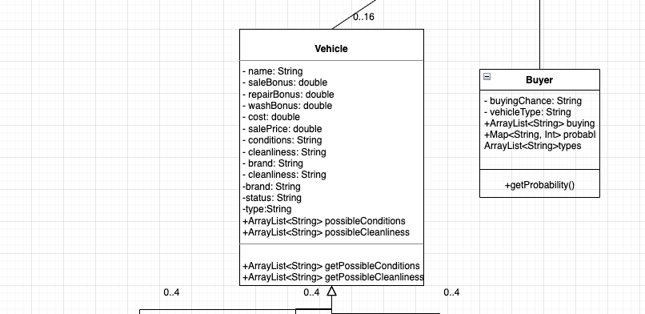
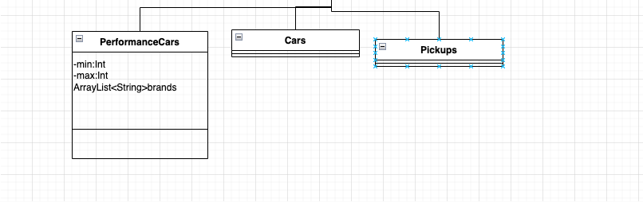

### CSCI 4/5448 OOAD
###### Group: Anuragini Sinha & Lin Shi
This is the repository for CSCI 4/5448 OOAD.  
This is the directory for project 2
##### Java Version: 19

##### UML:

##### Assumption:
* The intern must wash two different vehicles for each iteration. If there is just one vehicle to wash, then the intern will only wash one car. (same applies to mechanics).
* We decided to use integer values based on the sample output. 
* The simulation start on day 1 (Monday). Therefore, day 7, 14,... will be considered Sunday. 
* All name are generated using **position_<unique id>**. Therefore, when an intern steps up to take a Mechanic or Salesperson's job, their position will change, but <unique id> will stay the same. 
* Since we are just adding $250000 everytime that we do not have money, I am allowing the possibility of negative budget given that we will receive extra money at the end of the day. 
