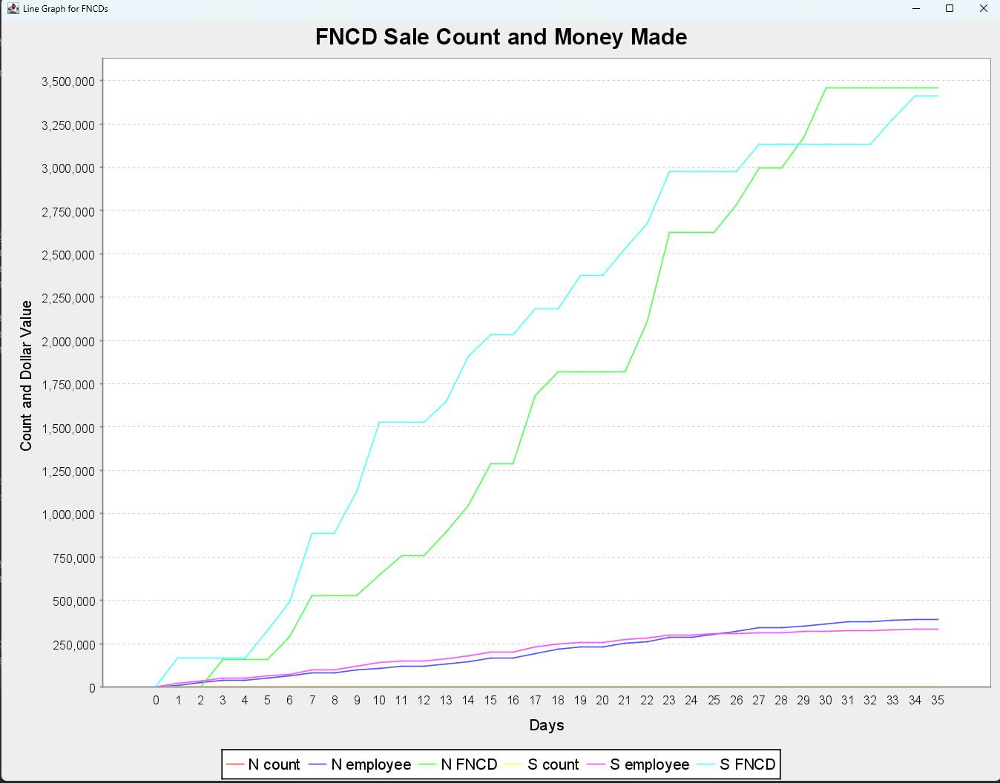
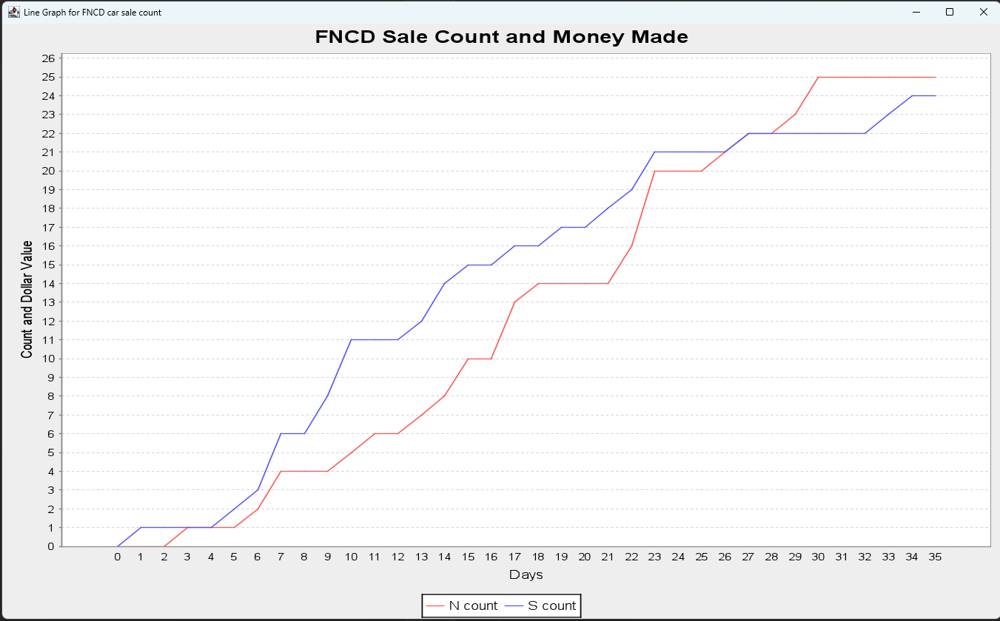

We used JFreeChart (imported through Maven) for the line graph and JFrame to display it.

Additionally, since the cumulative vehicles sold is hard to see when comparing with the money earned, we created its own graph.

