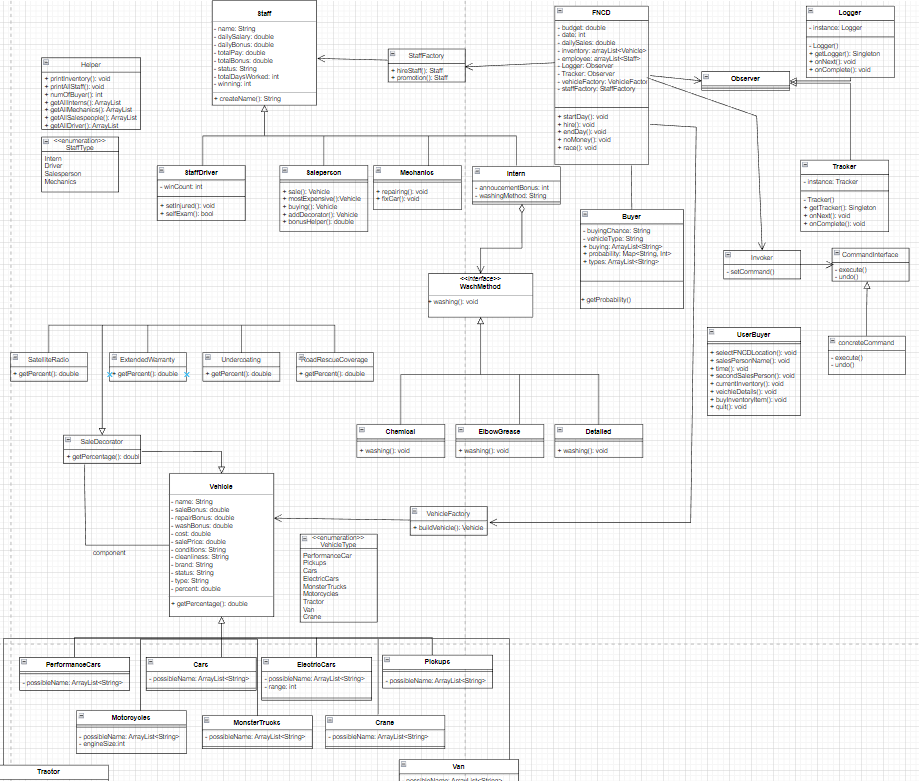
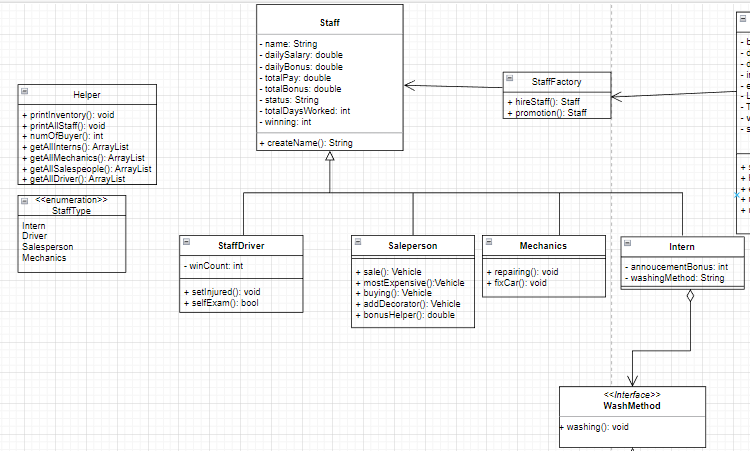
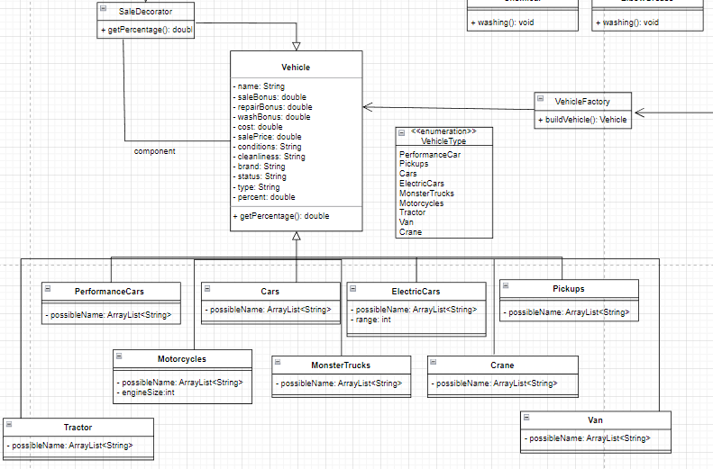
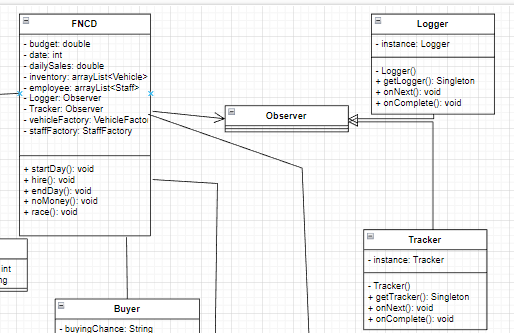
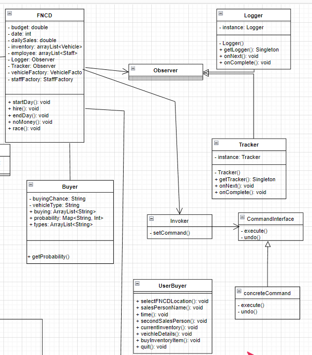
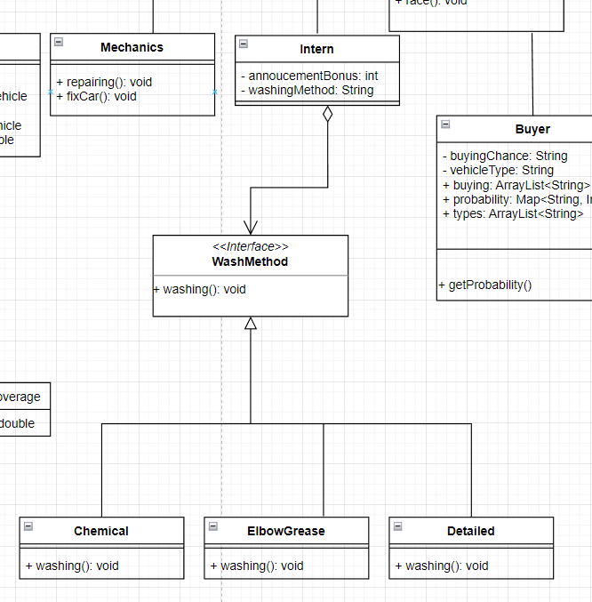

##### The whole UML diagram:

##### UML for Staff (factory):

##### UML for Vehicle (factory):
Note: FNCD is connected with VehicleFactory; however, since FNCD is all the way on the top right, I cannot include it. That is what the Vehicle Factory is connected to.

##### UML for Singleton:

##### UML for Command:

###### Old UML Just in Case (strategy and decorator):

